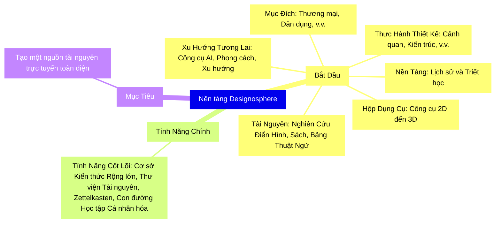

>[!seealso] [[Giới Thiệu|Read this page in Vietnamese]]

Đây là 1 nền tảng điện tử dưới dạng thư viện tổng hợp và sổ tay chuyên ngành dành cho tất cả mọi người từ kiến trúc sư, chuyên gia thiết kế, nghệ sĩ hay những ai yêu thích  lĩnh vực thiết kế, kiến trúc, và cảnh quan. [[Design-O-Sphere]] là một phương pháp quản lý kiến thức dạng "[[Design vs Decorate]]", nơi các ghi chú và ý tưởng liên kết với nhau tạo thành một thư viện động cho lĩnh vực thiết kế kiến trúc nội thất và cảnh quan.

---

## Bắt Đầu

Designosphere được cấu trúc xung quanh các Yếu tố và Mối quan hệ khác nhau, góp phần hình thành không gian chúng ta sinh sống; từ Nội thất đến Ngoại thất, từ Ánh sáng đến Vật liệu, từ Con người đến Thiên nhiên. Trong mỗi danh mục, chi tiết bao gồm:

- **Thực Hành Thiết Kế**: Bao gồm cảnh quan, kiến trúc, thiết kế nội thất, trang trí/styling nội thất, thiết kế không gian, thiết kế ánh sáng, thiết kế công nghiệp, khái niệm hóa và hình dung, trang trí sự kiện.
    
- **Nền Tảng của Thực Hành**: Khám phá Lịch sử và Triết học.
    
- **Mục Đích và Sử Dụng**: Các danh mục như Thương mại, Dân dụng, Khách sạn, và Sự kiện được đề cập.
    
- **Tương Lai của Thiết Kế**: Thảo luận về công cụ AI, Phong cách và Xu hướng.
    
- **Hộp Dụng Cụ**: Từ điển tất cả các công cụ được sử dụng từ 2D đến 3D, bao gồm hướng dẫn dễ dàng.
    
- **Các Nghiên Cứu Điển Hình**: Khám phá chi tiết các dự án thiết kế cụ thể.
    
- **Sách Được Khuyến Nghị và Bảng Thuật Ngữ**: Đọc liệu thiết yếu và bảng thuật ngữ.

>[!hint] Chỉ cần nhập những gì bạn đang tìm kiếm vào thanh tìm kiếm để bắt đầu.

## Tính Năng Chính

- **Cơ sở Kiến thức Rộng lớn**: Nền tảng này cung cấp một bộ sưu tập rộng lớn các tài nguyên về thiết kế không gian, kiến trúc và cảnh quan, được biên soạn để hỗ trợ cả người mới bắt đầu và chuyên gia. Bao gồm các bài viết toàn diện, nghiên cứu điển hình sâu rộng và hướng dẫn thực hành được thiết kế để nâng cao hiểu biết và kỹ năng của bạn trong các lĩnh vực thiết kế đa dạng.

- **Thư Viện Tài Nguyên**: Truy cập vào một bộ sưu tập rộng lớn các công cụ thiết kế, hướng dẫn phần mềm và thư viện đa phương tiện chứa đầy hình ảnh, sơ đồ và video. Những tài nguyên này được lựa chọn cẩn thận để truyền cảm hứng cho sự sáng tạo của bạn và hỗ trợ trong việc hình dung và thực hiện các dự án thiết kế của bạn.

- **Zettelkasten Tương Tác**: Áp dụng phương pháp Zettelkasten, nền tảng của chúng tôi cho phép tạo lập, liên kết và khám phá các ghi chú một cách không tuyến tính. Cách tiếp cận này tạo điều kiện cho việc hiểu sâu hơn về các mối liên kết phức tạp trong các khái niệm thiết kế không gian, khuyến khích một quá trình suy nghĩ toàn diện và đổi mới hơn.

- **Con Đường Học Tập Cá Nhân Hóa**: Tùy chỉnh hành trình giáo dục của bạn thông qua các đường học tập tùy chỉnh phù hợp với sở thích và trình độ năng lực của bạn. Dù bạn đang bắt đầu từ cơ bản hay muốn chuyên sâu vào một lĩnh vực thiết kế hẹp, những đường học này sẽ hướng dẫn bạn qua nội dung được biên soạn, đảm bảo một trải nghiệm học tập có cấu trúc và toàn diện. Tính năng này hỗ trợ mục tiêu của nền tảng là công cụ giáo dục toàn diện cho các nhà thiết kế, cho phép người dùng không chỉ truy cập vào một kho tàng thông tin mà còn có thể điều hướng nó một cách phù hợp với mục tiêu phát triển cá nhân và chuyên nghiệp của họ.

## Mục Tiêu

Tạo một không gian lưu trữ tất cả thông tin bạn cần và mọi thứ bạn muốn trực tuyến để bắt đầu dự án riêng của mình hoặc để mở rộng học hỏi. Hãy nghĩ về nó như một Wikipedia dành cho các nhà thiết kế, với những hiểu biết cá nhân được bao gồm.

>[!quote] "Thiết kế không chỉ là về vẻ ngoài và cảm giác. Thiết kế là cách nó hoạt động." - Steve Jobs